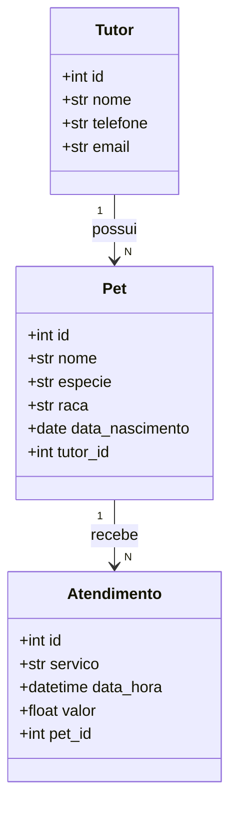

# Diagrama de Classes — Petshop

```mermaid
classDiagram
    class Tutor {
        +int id
        +str nome
        +str telefone
        +str email
    }
    class Pet {
        +int id
        +str nome
        +str especie
        +str raca
        +date data_nascimento
        +int tutor_id
    }
    class Atendimento {
        +int id
        +str servico
        +datetime data_hora
        +float valor
        +int pet_id
    }
    Tutor "1" --> "N" Pet : possui
    Pet "1" --> "N" Atendimento : recebe
```