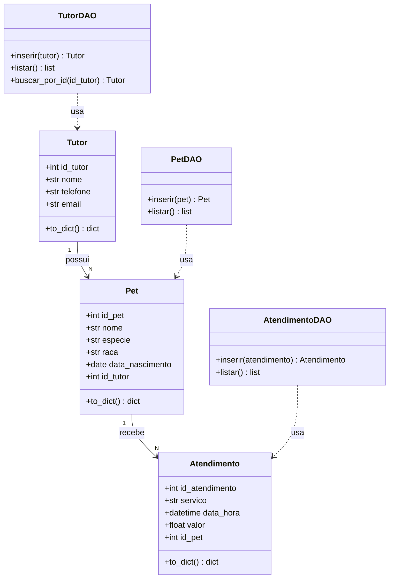

# Diagrama de Classes — Petshop

```mermaid
classDiagram
    class Tutor {
        +int id_tutor
        +str nome
        +str telefone
        +str email
        +to_dict() dict
    }
    class Pet {
        +int id_pet
        +str nome
        +str especie
        +str raca
        +date data_nascimento
        +int id_tutor
        +to_dict() dict
    }
    class Atendimento {
        +int id_atendimento
        +str servico
        +datetime data_hora
        +float valor
        +int id_pet
        +to_dict() dict
    }
    class TutorDAO {
        +inserir(tutor) Tutor
        +listar() list
        +buscar_por_id(id_tutor) Tutor
    }
    class PetDAO {
        +inserir(pet) Pet
        +listar() list
    }
    class AtendimentoDAO {
        +inserir(atendimento) Atendimento
        +listar() list
    }
    Tutor "1" --> "N" Pet : possui
    Pet "1" --> "N" Atendimento : recebe
    TutorDAO ..> Tutor : usa
    PetDAO ..> Pet : usa
    AtendimentoDAO ..> Atendimento : usa
```